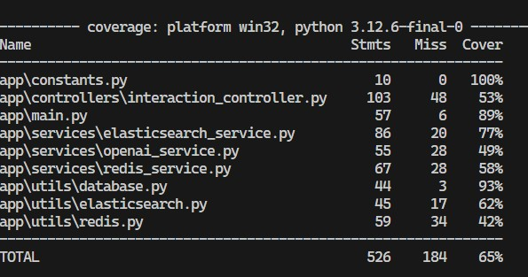

# CodeGPT Assistant

## Table of Contents

- [General Information](#general-information)
- [Description](#description)
- [Technologies](#technologies)
- [Setup](#setup)
  - [Clone the Repository](#clone-the-repository)
  - [Backend Setup](#backend-setup)
  - [Environment Setup](#environment-setup)
  - [Database Setup](#database-setup)
  - [Docker Setup](#docker-setup)
  - [Node.js Setup](#nodejs-setup)
- [Running](#running)
  - [Backend Running](#backend-running)
  - [Swagger Documentation](#swagger-documentation)
- [API Endpoints](#api-endpoints)
- [Project Structure](#project-structure)
- [Testing](#testing)
  - [Backend Testing](#backend-testing)
  - [VSCode Extension Testing](#vscode-extension-testing)
  - [Test Coverage](#test-coverage)
- [Code Quality Analysis](#code-quality-analysis)
  - [Backend](#backend)
  - [Extension](#extension)
- [Status](#status)
- [Created By](#created-by)

## General Information

The CodeGPT Assistant is a Visual Studio Code extension that integrates LangChain, ChatGPT, Redis, and ElasticSearch to provide personalized coding assistance. It is specifically optimized for Laravel projects, enabling developers to send code snippets and tasks to an AI model, retrieve context-aware responses, and store interactions in MongoDB for long-term reference.

## Description

CodeGPT Assistant enhances Laravel developers' productivity by embedding AI-powered support within VSCode. The assistant interprets Laravel-specific tasks, generates code snippets, and provides solutions tailored to the Laravel framework. Every interaction is cached and stored, ensuring cost efficiency and quick response times while maintaining the relevance and consistency of answers.

## Technologies

- **Frontend**:
  - Visual Studio Code Extension (TypeScript)
- **Backend**:
  - Python
  - FastAPI
  - LangChain (for LLM interactions)
  - OpenAI GPT-4 + models
- **Database**:
  - MongoDB (long-term storage)
  - ElasticSearch (relevance-based retrieval)
  - Redis (fast caching)
- **Others**:
  - Node.js (for extension development)
  - Docker

## Setup

### Clone the Repository

Clone the project repository:

```bash
git clone https://github.com/yourusername/CodeGPT-Assistant.git
```

### Backend Setup

Navigate to the backend directory and install Python dependencies:

```bash
cd CodeGPT-Assistant/backend
pip install -r requirements.txt
```

**Important**: Create and activate a virtual environment before installing dependencies:

```bash
python -m venv venv
source venv/bin/activate  # Windows: venv\Scripts\activate
```

### Environment Setup

Create a `.env` file in the backend directory with the following variables:

```plaintext
OPENAI_API_KEY=your-openai-api-key
MONGODB_URI=mongodb://mongodb:27017/codegpt
ELASTICSEARCH_URI=http://localhost:9200
REDIS_HOST=localhost
REDIS_PORT=6379
```

Replace placeholders with your actual keys and configuration.

### Database Setup

- **MongoDB**: Ensure MongoDB is running locally or in the cloud (e.g., MongoDB Atlas).
- **ElasticSearch**:
  1. Install ElasticSearch locally or use a cloud instance.
  2. Create the `qa_pairs` index:
     ```bash
     curl -X PUT "http://localhost:9200/qa_pairs" -H 'Content-Type: application/json' -d'
     {
       "mappings": {
         "properties": {
           "prompt": {"type": "text"},
           "response": {"type": "text"},
           "timestamp": {"type": "date"}
         }
       }
     }
     '
     ```
- **Redis**: Ensure Redis is running locally or on a cloud instance (e.g., Redis Enterprise).

### Docker Setup

Build and start the Docker containers in development mode:

```bash
docker-compose --profile dev up
```

For production mode:

```bash
docker-compose --profile prod up
```

This will set up the backend server, MongoDB, ElasticSearch, and Redis in Docker containers.

### Node.js Setup

Navigate to the VSCode extension directory and install dependencies:

```bash
cd ../extension
npm install
```

## Running

### Backend Running

If the Docker containers are running, the backend is already accessible. To run the backend without Docker:

```bash
uvicorn app.main:app --reload
```

The API will be available at `http://127.0.0.1:8000`.

### Swagger Documentation

FastAPI automatically generates interactive API documentation accessible at:

- Swagger UI: [http://127.0.0.1:8000/docs](http://127.0.0.1:8000/docs)
- ReDoc: [http://127.0.0.1:8000/redoc](http://127.0.0.1:8000/redoc)

### VSCode Extension Running

Open the extension directory in VSCode:

```bash
code extension
```

Press `F5` to launch the extension in a new Extension Development Host window.

## API Endpoints

### 1. `POST /submit`

- **Description**: Processes user prompts and code snippets to provide context-aware responses.
- **Request Body**:
  - `prompt`: Required. The user's question or task.
  - `code`: Optional. Code snippet from the user.
  - `language`: Optional. Specifies the programming language.
- **Example**:
  ```bash
  curl -X POST http://127.0.0.1:8000/submit -H "Content-Type: application/json" -d '{"prompt": "How do I create a new migration in Laravel?", "code": "", "language": "PHP"}'
  ```

- **Response**:
  ```json
  {
    "response": "To create a new migration in Laravel, you can use the Artisan command: php artisan make:migration create_users_table..."
  }
  ```

### 2. `GET /history`

- **Description**: Retrieves previous interactions.
- **Query Parameters**:
  - `query`: Optional. Text to search for similar prompts.
- **Example**:
  ```bash
  curl http://127.0.0.1:8000/history?query=migration
  ```

- **Response**:
  ```json
  [
    {
      "prompt": "How do I create a new migration in Laravel?",
      "response": "To create a new migration in Laravel, you can use the Artisan command..."
    },
    {
      "prompt": "Explain Eloquent relationships.",
      "response": "In Laravel's Eloquent ORM, relationships are defined..."
    }
  ]
  ```

## Project Structure

Updated to reflect Redis, ElasticSearch, and test directories:

```plaintext
backend/
│
├── app/
│   ├── models/
│   │   └── interaction.py
│   ├── controllers/
│   │   └── interaction_controller.py
│   ├── services/
│   │   ├── openai_service.py
│   │   ├── redis_service.py
│   │   └── elasticsearch_service.py
│   ├── main.py
│   ├── constants.py
│   └── utils/
│       ├── database.py
│       ├── elasticsearch.py
│       └── redis.py
│
├── tests/
│   ├── test_services/
│   │   ├── test_elasticsearch_service.py
│   │   ├── test_openai_service.py
│   │   └── test_redis_service.py
│   ├── test_utils/
│   │   ├── test_database.py
│   │   ├── test_elasticsearch.py
│   │   └── test_redis.py
│   └── test_controllers/
│       └── test_interaction_controller.py
├── .env
├── requirements.txt
├── docker-compose.yml
└── Dockerfile
```

## Testing

### Backend Testing

Run backend tests inside the Docker container:

```bash
docker exec -it codegpt-assistant_backend_1 pytest tests/
```

Or without Docker, from the `backend/` directory:

```bash
pytest tests/
```

To check coverage:

```bash
pytest --cov=app tests/
```

### Test Coverage

Below is the latest test coverage report:



## Code Quality Analysis

### Backend

Run `flake8` and `pylint` for Python code analysis:

```bash
flake8 .
pylint *.py
```

### Extension

Run ESLint for the extension:

```bash
npm run lint
```

## Status

Active

## Created By

Szaniszló Ivor, 2024
